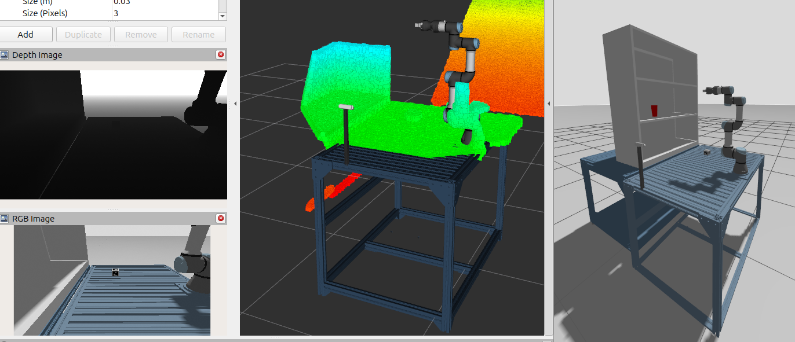

# YOLO-Point Cloud Pose Estimation
A comprehensive ROS 2 node exposing an action for promptable and accurate 6D pose of YOLO-informed targets without CAD models.
 

Result in simulation

## Overview


This package has been configured to work with ROS 2 Jazzy and Gazebo Harmonic.

To test the package, first change directory to your ROS2 workspace, build with `--symlink-install` and source your workspace:

```bash
cd <your_ros2_ws>
colcon build --symlink-install
source install/setup.bash
```

Then in one terminal, start the simulation and ancillary nodes by running the following command:
```bash
ros2 launch ur3e_hande_gz view_gz.launch.py
```

Then run the pose estimation node:
```bash
ros2 launch ur3e_hande_gz view_gz.launch.py
```

In simulation, the point clouds are available on the `/rgbd_camera/points` topic.

## LICENSE
Please see the following [link](LICENSE) for license information.