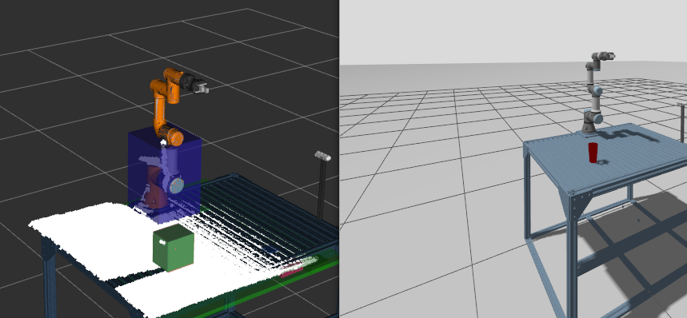
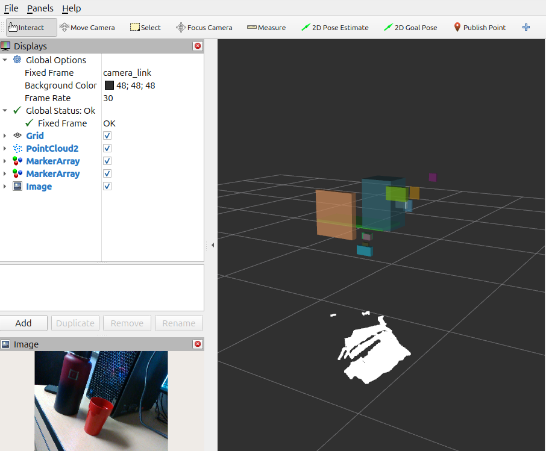

## Point-Cloud Based Object Detection and Plane Segmentation



### Camera-Only Description



To run the perception nodes for the real D435i, use the following launch file (add `launch_rviz:=false` if you do not want to bring up RViz)
```bash
ros2 launch ur3e_hande_perception perception_launch.py
```

An Rviz window will open showing the color image stream from the camera, filtered points from the point cloud stream, detected surfaces (planes; represented by green RViz markers), and objects (represented by RViz BOX markers of varying color and dimension (corresponding roughly to each detected object)). You can query the perception node for plane and object data by echoing their respective topics:

**Object markers**:
```bash
ros2 topic echo --once /object_markers
```

**Plane marker**:
```bash
ros2 topic echo --once /plane_marker 
```

